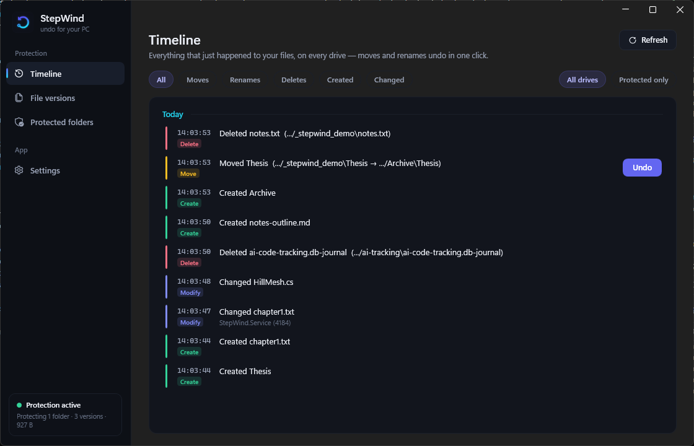
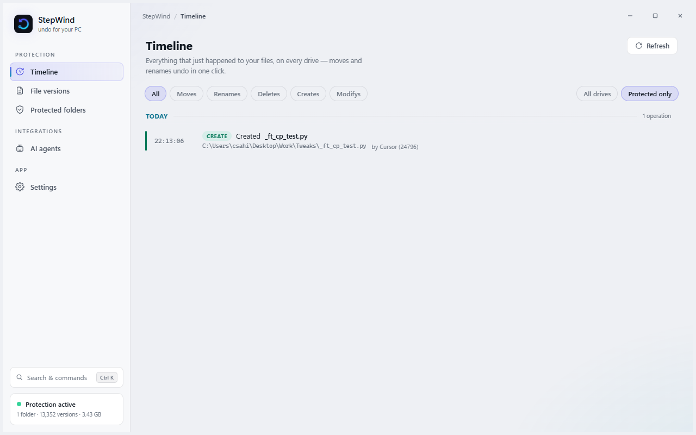
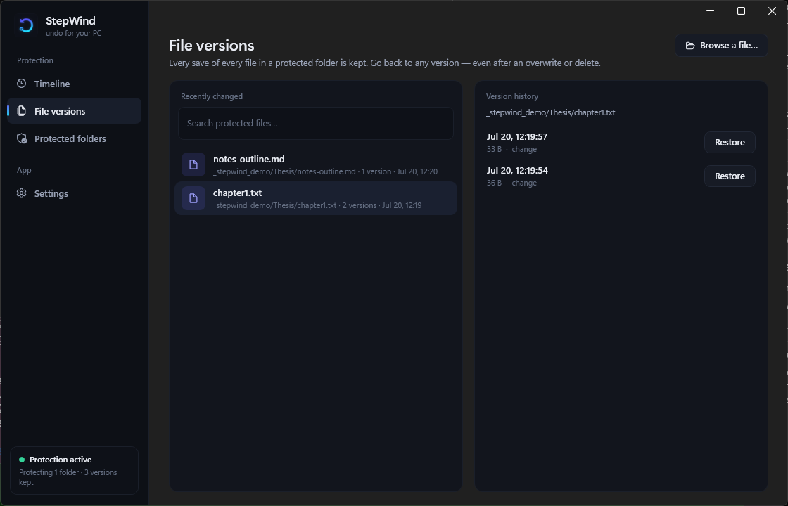
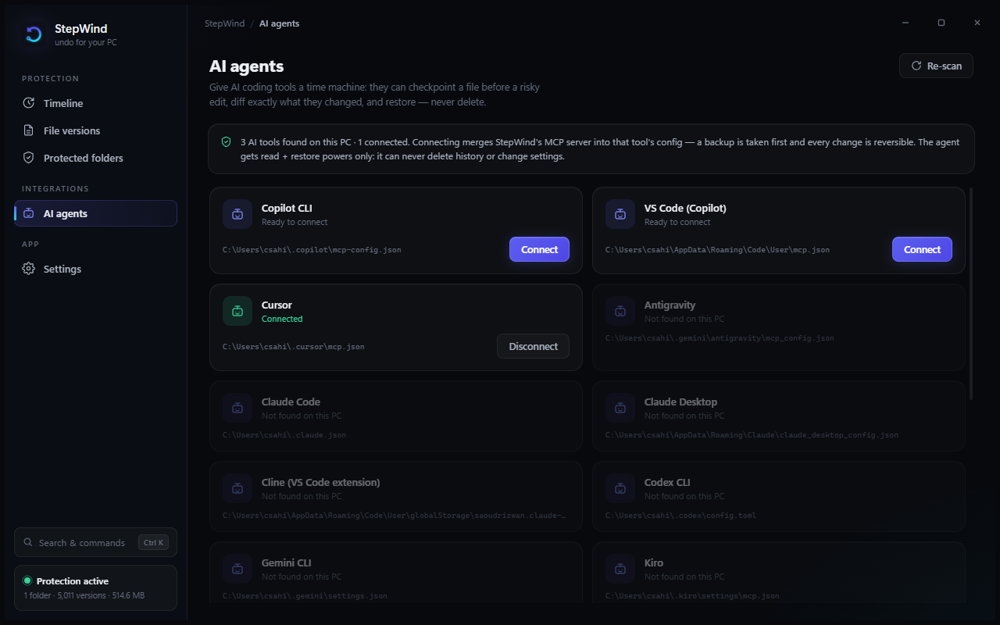
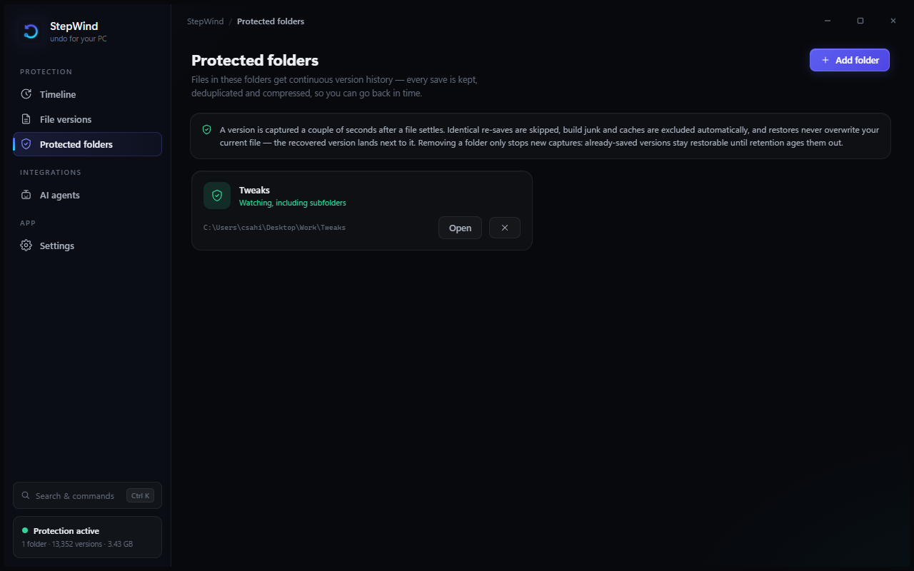
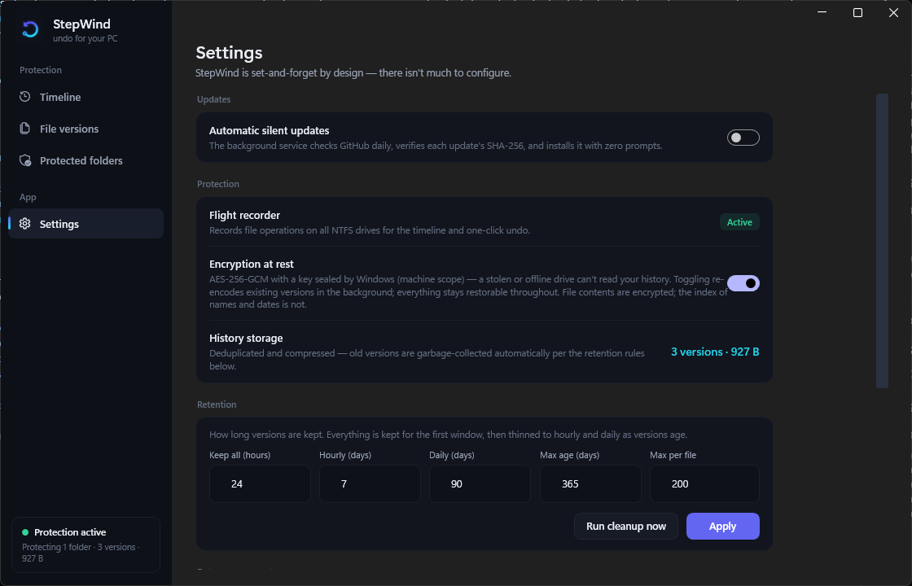

<div align="center">


# StepWind

**An undo button for your whole PC.**
Real-time protection against accidental moves, renames, deletes, and bad saves — for
everyone, not just people who use git.

[](https://github.com/pwnapplehat/StepWind/actions)
[](LICENSE)
[](https://dotnet.microsoft.com/)

Free · open source · 100% local · no cloud · no account · no telemetry

**[stepwind.app](https://stepwind.app)** · [Releases](https://github.com/pwnapplehat/StepWind/releases/latest) · [Security model](SECURITY.md) · [Enterprise](enterprise/README.md)



</div>

---

## The problem

You move a folder, accidentally hit Ctrl+Z one too many times, and it's *gone* — not in
the Recycle Bin, no warning, no trace. Windows Explorer's undo is silent and can
permanently delete files, and this has been true for 20 years. Or you overwrite a good
draft with a bad one and only notice tomorrow. `git` protects committed code; it does
nothing for the uncommitted work — or for the 99% of people who don't use it.

Existing tools only version file **content** on a schedule. None of them record the
**operation** — the move/rename/delete itself — so none can simply *undo* it. StepWind does.

## Two layers of protection

**1. A flight recorder for your whole machine.** StepWind tails the NTFS change journal on
every drive and reconstructs a live, plain-English timeline of what happened — "Explorer
moved *Thesis* to Archive at 2:31 PM", attributed to the app that did it. A move or rename
is reversed with **one click**, instantly, needing no stored copy of your data.

**2. A time machine for the folders you care about.** Documents, Desktop, and your own
picks get continuous version history. Every save is captured as content-defined,
deduplicated, compressed chunks (the same technique restic/borg use), streamed one chunk at a
time so a 2 GB file is never held in memory, so scrolling a file back to any earlier version —
even after it was overwritten *and* deleted — is instant, and a lightly-edited 2 GB file
doesn't cost 2 GB per save. A brand-new file is captured within a moment of being created, so
even a file created and deleted seconds later can still be brought back. When a deleted file
has saved history, the timeline offers a one-click **Restore**; when it genuinely has none, it
says so plainly instead of pretending.

## A safety net for AI coding agents too

AI tools edit files fast — and sometimes wrong. StepWind ships an **MCP server** that gives
agents like Cursor and Claude a time machine over your protected folders: checkpoint a file
before a risky change, see a unified diff of exactly what the agent changed since, and
restore if it went badly. **Read-only + additive by design** — an agent can look, diff,
checkpoint, and restore (restores never overwrite), but it can never delete history or touch
settings.

The **AI agents** tab detects the tools installed on your PC — Cursor, Claude Desktop,
Claude Code, Antigravity, Windsurf, VS Code (Copilot), Cline, Gemini CLI, Codex CLI, Copilot
CLI, LM Studio, Kiro — and connects any of them with **one click**. StepWind merges its entry
into the tool's own MCP config the production-grade way: strict-parse-or-refuse (a config
with comments is never rewritten and silently stripped), a timestamped backup before every
change, atomic writes, and post-write verification that auto-restores the backup if anything
looks wrong. Disconnecting removes exactly our entry and nothing else.

Tools give an agent *capabilities*; habits are what keep your files safe. So where the tool
supports **Agent Skills** (Cursor, Claude Code), connecting also installs StepWind's skill —
a `SKILL.md` that teaches the AI to checkpoint before risky edits, diff `latest:` vs
`current:` after them, and restore instead of guessing when something breaks. Other
skill-capable tools can copy the same skill from the manual-setup card.

## Built right from day one

- **Content-defined chunking + dedup** so history is cheap even for huge files, and identical
  re-saves don't add redundant versions.
- **Crash-safe, content-verified store** (atomic writes; every chunk re-hashed on read; GC is
  serialized against captures so it can never sweep an in-flight chunk).
- **Encryption at rest is a live toggle** (AES-256-GCM, key sealed by Windows DPAPI at machine
  scope — no passphrase needed, and a stolen/offline drive can't be read elsewhere). Flip it
  any time: the store re-encodes in the background while every version stays restorable, a
  crash mid-pass resumes on next start, and toggling off decrypts back the same way. File
  contents are encrypted; the index of names/dates is not. (Not designed to hide data from
  another admin on *this* machine.)
- **Retention + garbage collection** (tiered like Time Machine) so it never eats your disk.
- **Catch-up while off**: on startup (and when you add a folder) StepWind reconciles what
  changed or appeared while it wasn't running; USN wrap/overflow detection resyncs instead of
  silently missing changes; a watcher that overflows under a burst is rebuilt and reconciled.
- **Restores never overwrite** — a recovered version lands beside your current work, never on top.
- **Reversal is guarded** — it refuses to move something back onto a now-occupied path.
- **Panic hotkey** — Ctrl+Shift+Z opens StepWind from anywhere the instant something goes wrong.
- **Your data, your controls** — removing a folder asks whether to keep or delete its saved
  versions; Settings has delete-all, clean-up-unprotected, and run-cleanup-now (all confirmed
  first); retention windows are editable; the timeline can be scoped to protected folders only.
- **Exclusions** — exclude any subfolder or path inside a protected folder (heavy build
  outputs, datasets, caches) from Protected folders → Excluded; adding one offers to clear
  the versions already saved under it. This is on top of the automatic skips.
- **Smart exclusions** — build junk (`node_modules`, `target`…), caches, and — importantly —
  OneDrive online-only files are skipped (versioning a placeholder would force a full download).
  Files held under an *exclusive* lock (e.g. an open Outlook PST) are captured when the app
  releases them / on the next reconcile — StepWind doesn't force snapshots of locked files.
- **Honest architecture, authorized per user**: an elevated background **service** does the
  privileged work (journal + ETW); the tray **GUI** runs unelevated and talks to it over a
  local, ACL'd pipe. The service authorizes every private or destructive request against the
  user who made it — on a shared PC one account can't read, restore, or purge another
  account's history, undo handles can't be forged into arbitrary file moves, and wiping all
  history takes an administrator.
- **Never fills your disk, never fails silently** — if the drive holding your history runs
  low on space, capturing pauses loudly (the status says so), thins old versions to win space
  back, and resumes on its own once there's room. It won't quietly stop protecting you the way
  Windows File History was known to.
- **Fail-closed, verified updates** — the SYSTEM service checks GitHub for new releases and
  installs an update **only** if it passes a SHA-256 checksum matched to its filename **and** a
  trusted Authenticode code signature; a release missing either is refused rather than run. The
  installer backs up the current version and rolls back automatically if a new build won't
  start, so an update can never leave you unprotected. (Until releases are code-signed, silent
  auto-install stays disabled — the safe default.)

## A UI designed for the job

StepWind's interface is **web-rendered inside WebView2** — the same architecture the most
polished desktop apps use (VS Code, Discord, Linear, 1Password), without shipping Chromium:
Windows' built-in Evergreen WebView2 runtime does the rendering, so the installer stays
lean and every pixel is drawn by an auditable, dependency-free web layer that ships as
plain files beside the exe. The thin .NET host owns only what the web platform can't: the
chromeless window, the tray icon, the global panic hotkey, and an **allow-listed JSON
bridge** to the service (the web layer can only call what's explicitly listed, and settings
patches only carry explicitly allowed keys).

The design itself is a premium identity built around the product's core idea: a **time
river**. Operations flow down the timeline grouped by day, each with a color-coded rail
(create / change / move / rename / delete), monospaced clock time, the app that did it, and
an Undo button on hover. Filter chips narrow the river; a scope toggle limits it to
protected folders. **File versions is a folder browser** with breadcrumbs and recursive
search, paired with full version history and — because the web stack is genuinely better at
this — an **inline unified diff viewer**: click any version to see exactly what changed
against the file on disk now (or the version's own content if the file is gone). A **command
palette (Ctrl+K)** searches every command and every file in the version store. Views
fade-and-rise, rows cascade in, the nav indicator glides, dialogs scale in, and the
"protection active" dot has a gentle heartbeat.

**Light and dark, done properly.** Every surface, overlay, shadow, and text accent is a
theme token, so the light theme is as considered as the dark one — not an inverted
afterthought. Choose **System** (follows Windows and switches live when you do), **Light**,
or **Dark** in Settings → Appearance.

| Dark | Light |
|---|---|
|  |  |

| File versions (folder browser) | AI agents | Protected folders | Settings |
|---|---|---|---|
|  |  |  |  |

## Architecture

```
src/StepWind.Core/     engine: FastCDC chunker, content-addressed store (+AES-GCM),
                       retention/GC, USN journal reader, operation reconstruction &
                       reversal, ETW attribution, flight recorder, watch engine, IPC,
                       unified-diff engine, MCP client auto-configurator
src/StepWind.Service/  elevated Windows service: hosts the engine + named-pipe API
src/StepWind.App/      unelevated tray app: chromeless WebView2 host + allow-listed JSON
                       bridge; the UI itself is ./web (dependency-free HTML/CSS/JS)
src/StepWind.Mcp/      MCP server for AI agents (stdio): checkpoint / diff / restore
src/StepWind.Cli/      diagnostics + real-hardware E2E harness
tests/                 deterministic Core tests
```

## Verified

- **294 unit tests** — chunker determinism & shift-resistance, store dedup/crash-safety/
  integrity, encryption round-trip & tamper rejection, DPAPI key stability, live encryption
  toggling (mixed-store reads, background re-encode convergence in both directions,
  interrupted-migration recovery, storage byte tracking, the IPC toggle end-to-end), USN
  operation reconstruction (rename vs move via parent-FRN delta; POSIX-unlink deletes
  detected at the marker-rename instant, with the late FileDelete deduplicated and hex-named
  user files never misclassified), version-level dedup of identical re-saves, startup
  reconciliation (baseline + catch-up + idempotency), GC-vs-capture interleaving integrity,
  reversal safety, retention tiers + GC (and configurable retention with clamping), folder
  removal (captures stop, nothing reseeds, purge all/unprotected/folder/file), exclusions
  (incl. cloud placeholders), watch capture, the full IPC capture→history→restore round-trip,
  the unified-diff engine (fuzzed against a reference LCS; hunk-header correctness; large
  compound edits), the AI/MCP surface (checkpoint→edit→diff→restore agent workflow, binary/
  oversize honesty, selector errors), the MCP client auto-configurator (merge preserves
  every existing key, JSONC/broken files refused untouched, idempotent installs, TOML block
  surgery, backups, BOM preservation), **pre-delete capture** (a create+delete inside the
  quiet window still leaves a restorable version), **per-user authorization** (one account
  can't read/restore/purge another's history, forged undo handles are rejected, machine-wide
  wipe needs admin), the **fail-closed updater** (missing/mismatched checksum refused,
  filename-matched sums, unsigned setup never launched), and the **disk-full guard**
  (capture pauses and resumes around a free-space floor and store quota), **USN gap detection**
  (a wrapped/truncated journal resyncs loudly instead of dropping operations), **store
  verify/repair** + index backup (damaged versions are found and quarantined, the good ones kept),
  **encryption recovery-key** export/import (survives an OS reinstall), **batch undo** (per-item
  results, never stops halfway), **long-path** capture, the **resync policy**, **concurrent-IPC**
  thread-safety, the **MCP gateway allow-list**, **git branch/commit annotation** + the opt-in
  **.gitignore matcher**, **guided store relocation** (copy→verify→switch, never deleting the old
  store), and **index (metadata) encryption** (read-always/write-conditional so toggling never
  orphans history).
- **Real-hardware E2E** (elevated): a scripted create/rename/move/delete is reconstructed
  from the live journal, the move is reversed (folder back in one click), and a version is
  restored byte-exact after overwrite+delete — all through the production classes. The
  delete's journal shape (bare-hex marker rename; FileDelete lagging until the last handle
  closes) was measured on real hardware and is what the detector is built against.
- **Live demo**: the real service running with encryption on (key sealed, zero plaintext in
  blobs), the timeline populated with an actual incident, Undo working, and a UI-automation
  pass driving recent-files → version history → Restore (see the screenshot above).

## Install

Download **StepWind-x.y.z-setup.exe** from
[Releases](https://github.com/pwnapplehat/StepWind/releases) and run it. The installer sets
up the background service (auto-start), starts protecting immediately, and launches the tray
app (which then starts with Windows). StepWind checks for updates and applies them only when
they pass its checksum + code-signature verification, rolling back automatically if a new
build won't start. Uninstall from Settings → Apps like any program; your version history is
left intact.

Windows 10 (1809+) or Windows 11, an NTFS drive.

> **"Windows protected your PC"?** Expected for a new unsigned installer — not a malware
> detection. Click **More info → Run anyway**. Every release ships a `SHA256SUMS.txt`; verify
> your download with `(Get-FileHash .\StepWind-x.y.z-setup.exe -Algorithm SHA256).Hash` and
> compare. Code signing (which removes this prompt) is planned via the free **SignPath
> Foundation** open-source program — see [SECURITY.md](SECURITY.md).

## Security

StepWind runs a LocalSystem service, so its trust boundaries are written down explicitly in
**[SECURITY.md](SECURITY.md)**: who may read/restore/purge which history over the pipe (the
service authorizes every request against the connecting Windows user), why timeline undo handles
can't be forged, what encryption does and doesn't cover, and how updates are verified
(checksum + Authenticode, fail-closed — an unsigned build is staged for a one-click, you-approve
install rather than run silently). Found something? Open a
[security advisory](https://github.com/pwnapplehat/StepWind/security/advisories/new).

## Building

```powershell
dotnet build StepWind.slnx      # build everything
dotnet test                     # Core test suite
./build/publish.ps1             # self-contained service + GUI + CLI + MCP server → dist/
iscc installer\stepwind.iss     # build the setup .exe → installer/Output/
```

Requires the .NET 10 SDK (and Inno Setup 6 for the installer).

## License

[MIT](LICENSE) — © 2026 StepWind Contributors. Made by iOS_hAT.
